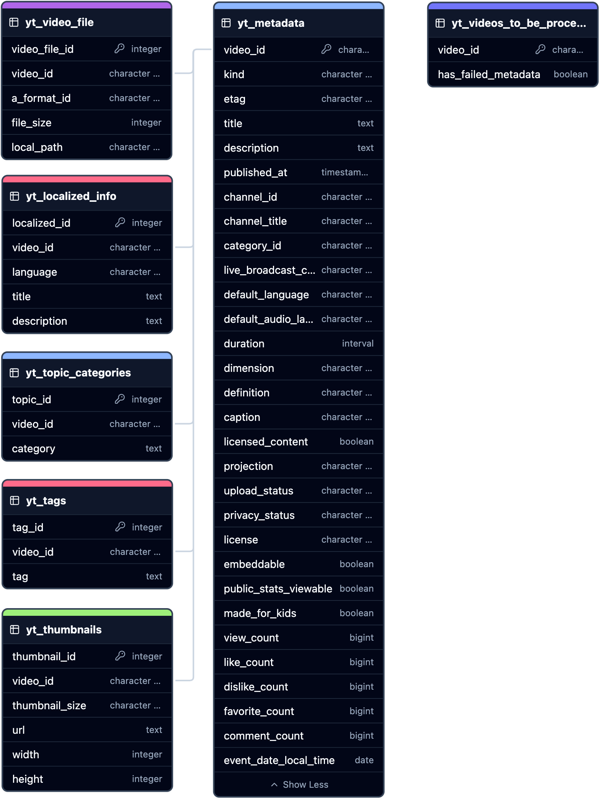

# Database Schema Documentation

This document provides a comprehensive overview of the database schema used in the project. The schema is designed to store and manage data related to YouTube videos, including metadata, tags, and thumbnails.

---

## Schema Diagram

To better understand the structure and relationships within the database, refer to the following schema diagram.

<!-- https://app.chartdb.io/diagrams/4gnbhluww2ss -->

An SVG version is available [here](images/yt_dlp_async_db_schema.svg).

---

## Table of Contents

- [1. YouTube-Related Database Objects](#1-youtube-related-database-objects)
  - [1.1. Tables](#11-tables)
    - [1.1.1. `yt_video_ids`](#111-yt_video_ids)
    - [1.1.2. `yt_videos_to_be_processed`](#112-yt_videos_to_be_processed)
    - [1.1.3. `yt_metadata`](#113-yt_metadata)
    - [1.1.4. `yt_tags`](#114-yt_tags)
    - [1.1.5. `yt_thumbnails`](#115-yt_thumbnails)
    - [1.1.6. `yt_localized_info`](#116-yt_localized_info)
    - [1.1.7. `yt_topic_categories`](#117-yt_topic_categories)
    - [1.1.8. `yt_content_rating`](#118-yt_content_rating)
    - [1.1.9. `yt_recording_details`](#119-yt_recording_details)
    - [1.1.10. `yt_transcripts`](#1110-yt_transcripts)
    - [1.1.11. `yt_video_file`](#1111-yt_video_file)
  - [1.2. Functions and Triggers](#12-functions-and-triggers)
    - [1.2.1. Function: `update_modified_at_column`](#121-function-update_modified_at_column)
    - [1.2.2. Function: `propagate_soft_delete_to_related_tables`](#122-function-propagate_soft_delete_to_related_tables)
    - [1.2.3. Function: `delete_from_yt_videos_to_be_processed`](#123-function-delete_from_yt_videos_to_be_processed)
- [2. Soft Delete Mechanism](#2-soft-delete-mechanism)
  - [2.1. Functions and Triggers](#21-functions-and-triggers)
- [3. Indexes](#3-indexes)
- [4. Permissions](#4-permissions)
- [Additional Notes](#additional-notes)
- [Conclusion](#conclusion)

---

## 1. YouTube-Related Database Objects

### 1.1. Tables

#### 1.1.1. `yt_video_ids`

**Purpose**: Stores unique YouTube video IDs for tracking and processing.

**Columns**:

- `video_id` (VARCHAR, Primary Key): The unique identifier of the YouTube video.
- `created_at` (TIMESTAMP WITH TIME ZONE): Timestamp when the record was created.
- `modified_at` (TIMESTAMP WITH TIME ZONE): Timestamp when the record was last modified.
- `deleted_at` (TIMESTAMP WITH TIME ZONE): Timestamp when the record was soft-deleted.

---

#### 1.1.2. `yt_videos_to_be_processed`

**Purpose**: Stores YouTube video IDs that need to be processed for metadata retrieval.

**Columns**:

- `video_id` (VARCHAR, Primary Key): The unique identifier of the YouTube video.
- `has_failed_metadata` (BOOLEAN): Indicates if metadata retrieval has failed for this video.
- `created_at` (TIMESTAMP WITH TIME ZONE): Timestamp when the record was created.
- `modified_at` (TIMESTAMP WITH TIME ZONE): Timestamp when the record was last modified.
- `deleted_at` (TIMESTAMP WITH TIME ZONE): Timestamp when the record was soft-deleted.

---

#### 1.1.3. `yt_metadata`

**Purpose**: Stores detailed metadata for YouTube videos.

**Columns**:

- `video_id` (VARCHAR, Primary Key): The unique identifier of the YouTube video.
- `kind` (VARCHAR): The kind of resource.
- `etag` (VARCHAR): ETag of the resource.
- `title` (TEXT): Title of the video.
- `description` (TEXT): Description of the video.
- `published_at` (TIMESTAMP WITH TIME ZONE): When the video was published.
- `channel_id` (VARCHAR): ID of the channel that published the video.
- `channel_title` (VARCHAR): Title of the channel that published the video.
- `category_id` (VARCHAR): Category ID assigned to the video.
- `live_broadcast_content` (VARCHAR): Indicates if the video is a live broadcast.
- `default_language` (VARCHAR): Default language of the video.
- `default_audio_language` (VARCHAR): Default audio language of the video.
- `duration` (INTERVAL): Duration of the video.
- `dimension` (VARCHAR): Video dimension (e.g., 2D, 3D).
- `definition` (VARCHAR): Video definition (e.g., HD, SD).
- `caption` (VARCHAR): Indicates if the video has captions.
- `licensed_content` (BOOLEAN): Indicates if the video is licensed content.
- `projection` (VARCHAR): Type of projection (e.g., rectangular).
- `upload_status` (VARCHAR): Upload status of the video.
- `privacy_status` (VARCHAR): Privacy status (e.g., public, private).
- `license` (VARCHAR): License of the video.
- `embeddable` (BOOLEAN): Indicates if the video is embeddable.
- `public_stats_viewable` (BOOLEAN): Indicates if public stats are viewable.
- `made_for_kids` (BOOLEAN): Indicates if the video is made for kids.
- `view_count` (BIGINT): Number of views.
- `like_count` (BIGINT): Number of likes.
- `dislike_count` (BIGINT): Number of dislikes.
- `favorite_count` (BIGINT): Number of times favorited.
- `comment_count` (BIGINT): Number of comments.
- `event_date_local_time` (DATE): Local date of the event associated with the video.
- `created_at` (TIMESTAMP WITH TIME ZONE): Timestamp when the record was created.
- `modified_at` (TIMESTAMP WITH TIME ZONE): Timestamp when the record was last modified.
- `deleted_at` (TIMESTAMP WITH TIME ZONE): Timestamp when the record was soft-deleted.

---

#### 1.1.4. `yt_tags`

**Purpose**: Stores tags associated with YouTube videos.

**Columns**:

- `tag_id` (SERIAL, Primary Key): Unique identifier for the tag record.
- `video_id` (VARCHAR, Foreign Key): The video associated with the tag.
- `tag` (TEXT): The tag text.
- `created_at` (TIMESTAMP WITH TIME ZONE): Timestamp when the tag was created.
- `modified_at` (TIMESTAMP WITH TIME ZONE): Timestamp when the tag was last modified.
- `deleted_at` (TIMESTAMP WITH TIME ZONE): Timestamp when the tag was soft-deleted.

**Constraints**:

- Unique constraint on (`video_id`, `tag`) to prevent duplicate tags for a video.

---

#### 1.1.5. `yt_thumbnails`

**Purpose**: Stores thumbnail information for YouTube videos.

**Columns**:

- `thumbnail_id` (SERIAL, Primary Key): Unique identifier for the thumbnail record.
- `video_id` (VARCHAR, Foreign Key): The video associated with the thumbnail.
- `thumbnail_size` (VARCHAR): Size category of the thumbnail (e.g., default, medium, high).
- `url` (TEXT): URL of the thumbnail image.
- `width` (INTEGER): Width of the thumbnail image.
- `height` (INTEGER): Height of the thumbnail image.
- `created_at` (TIMESTAMP WITH TIME ZONE): Timestamp when the thumbnail was created.
- `modified_at` (TIMESTAMP WITH TIME ZONE): Timestamp when the thumbnail was last modified.
- `deleted_at` (TIMESTAMP WITH TIME ZONE): Timestamp when the thumbnail was soft-deleted.

**Constraints**:

- Unique constraint on (`video_id`, `thumbnail_size`) to prevent duplicate thumbnails for a video size category.

---

#### 1.1.6. `yt_localized_info`

**Purpose**: Stores localized titles and descriptions for YouTube videos.

**Columns**:

- `localized_id` (SERIAL, Primary Key): Unique identifier for the localized info record.
- `video_id` (VARCHAR, Foreign Key): The video associated with the localized info.
- `language` (VARCHAR): Language code of the localized info.
- `title` (TEXT): Localized title.
- `description` (TEXT): Localized description.
- `created_at` (TIMESTAMP WITH TIME ZONE): Timestamp when the record was created.
- `modified_at` (TIMESTAMP WITH TIME ZONE): Timestamp when the record was last modified.
- `deleted_at` (TIMESTAMP WITH TIME ZONE): Timestamp when the record was soft-deleted.

**Constraints**:

- Unique constraint on (`video_id`, `language`) to prevent duplicate localized info for a video and language.

---

#### 1.1.7. `yt_topic_categories`

**Purpose**: Stores topic categories associated with YouTube videos.

**Columns**:

- `topic_id` (SERIAL, Primary Key): Unique identifier for the topic category record.
- `video_id` (VARCHAR, Foreign Key): The video associated with the topic category.
- `category` (TEXT): The topic category.
- `created_at` (TIMESTAMP WITH TIME ZONE): Timestamp when the record was created.
- `modified_at` (TIMESTAMP WITH TIME ZONE): Timestamp when the record was last modified.
- `deleted_at` (TIMESTAMP WITH TIME ZONE): Timestamp when the record was soft-deleted.

**Constraints**:

- Unique constraint on (`video_id`, `category`) to prevent duplicate topic categories for a video.

---

#### 1.1.8. `yt_content_rating`

**Purpose**: Stores content rating information for YouTube videos.

**Columns**:

- `rating_id` (SERIAL, Primary Key): Unique identifier for the content rating record.
- `video_id` (VARCHAR, Foreign Key): The video associated with the content rating.
- `rating_type` (VARCHAR): Type of content rating (e.g., MPAA, BBFC).
- `rating_value` (VARCHAR): The rating value (e.g., PG-13, 15).
- `created_at` (TIMESTAMP WITH TIME ZONE): Timestamp when the record was created.
- `modified_at` (TIMESTAMP WITH TIME ZONE): Timestamp when the record was last modified.
- `deleted_at` (TIMESTAMP WITH TIME ZONE): Timestamp when the record was soft-deleted.

**Constraints**:

- Unique constraint on (`video_id`, `rating_type`) to prevent duplicate ratings for a video and rating type.

---

#### 1.1.9. `yt_recording_details`

**Purpose**: Stores recording details for YouTube videos.

**Columns**:

- `recording_id` (SERIAL, Primary Key): Unique identifier for the recording details record.
- `video_id` (VARCHAR, Foreign Key): The video associated with the recording details.
- `recording_date` (DATE): Date when the video was recorded.
- `recording_location` (TEXT): Location where the video was recorded.
- `created_at` (TIMESTAMP WITH TIME ZONE): Timestamp when the record was created.
- `modified_at` (TIMESTAMP WITH TIME ZONE): Timestamp when the record was last modified.
- `deleted_at` (TIMESTAMP WITH TIME ZONE): Timestamp when the record was soft-deleted.

**Constraints**:

- Unique constraint on (`video_id`, `recording_date`, `recording_location`) to prevent duplicate recording details for a video.

---

#### 1.1.10. `yt_transcripts`

**Purpose**: Stores transcripts for YouTube videos.

**Columns**:

- `transcript_id` (SERIAL, Primary Key): Unique identifier for the transcript record.
- `video_id` (VARCHAR, Foreign Key): The video associated with the transcript.
- `transcript_text` (TEXT): The transcript text.
- `language` (VARCHAR): Language code of the transcript.
- `is_auto_generated` (BOOLEAN): Indicates if the transcript was auto-generated.
- `created_at` (TIMESTAMP WITH TIME ZONE): Timestamp when the transcript was created.
- `modified_at` (TIMESTAMP WITH TIME ZONE): Timestamp when the transcript was last modified.
- `deleted_at` (TIMESTAMP WITH TIME ZONE): Timestamp when the transcript was soft-deleted.

**Constraints**:

- Unique constraint on (`video_id`, `language`) to prevent duplicate transcripts for a video and language.

---

#### 1.1.11. `yt_video_file`

**Purpose**: Stores information about downloaded video files.

**Columns**:

- `video_file_id` (SERIAL, Primary Key): Unique identifier for the video file record.
- `video_id` (VARCHAR, Foreign Key): The video associated with the file.
- `a_format_id` (VARCHAR): Format ID of the audio/video file.
- `file_size` (INTEGER): Size of the file in bytes.
- `local_path` (VARCHAR): Local file system path where the file is stored.
- `created_at` (TIMESTAMP WITH TIME ZONE): Timestamp when the file record was created.
- `modified_at` (TIMESTAMP WITH TIME ZONE): Timestamp when the file record was last modified.
- `deleted_at` (TIMESTAMP WITH TIME ZONE): Timestamp when the file record was soft-deleted.

**Constraints**:

- Unique constraint on (`video_id`, `a_format_id`) to prevent duplicate file records for a video and format.

---

### 1.2. Functions and Triggers

#### 1.2.1. Function: `update_modified_at_column`

**Purpose**: Updates the `modified_at` timestamp to the current time before a row is updated. This function ensures that the `modified_at` column accurately reflects the last modification time.

**Usage**: This function is called by triggers that are set to execute before update operations on tables.

---

#### 1.2.2. Function: `propagate_soft_delete_to_related_tables`

**Purpose**: When a video is soft-deleted in the `yt_metadata` table (i.e., the `deleted_at` column is set), this function propagates the soft delete to all related tables that reference the video ID. This ensures data integrity and consistent soft deletion across related records.

**Affected Tables**:

- `yt_tags`
- `yt_thumbnails`
- `yt_localized_info`
- `yt_topic_categories`
- `yt_content_rating`
- `yt_recording_details`
- `yt_transcripts`
- `yt_video_file`

---

#### 1.2.3. Function: `delete_from_yt_videos_to_be_processed`

**Purpose**: Removes a video ID from the `yt_videos_to_be_processed` table after it has been inserted into the `yt_metadata` table. This function helps manage the list of videos that need to be processed by ensuring that videos sucessfully processed are not processed again.

---

## 2. Soft Delete Mechanism

### 2.1. Functions and Triggers

The database uses a soft delete mechanism, where records are not physically removed but are marked as deleted by setting the `deleted_at` timestamp. This allows for data recovery and historical data analysis.

**Key Functions and Triggers**:

- **Soft Delete Propagation Functions**: Functions like `propagate_soft_delete_experiments`, `propagate_soft_delete_test_prompts`, and `propagate_soft_delete_tests` are designed to propagate the soft delete action to related tables when a parent record is soft-deleted.

- **Triggers**: Triggers are set up on parent tables to automatically call the appropriate propagation function after an update that sets the `deleted_at` column.

---

## 3. Indexes

Indexes are created on various columns to improve query performance, especially on columns frequently used in `WHERE` clauses and joins.

**Examples**:

- Indexes on `video_id` in tables like `yt_tags`, `yt_thumbnails`, etc., to speed up queries involving video IDs.
- Indexes on `experiment_id`, `segment_id`, and `test_case_id` in experimental tables to optimize experiment-related queries.
- Unique indexes to enforce constraints and ensure data integrity.

---

## 4. Permissions

- Grants all privileges on all tables in the `public` schema to the user `itguy`.
- Grants usage and select permissions on all sequences in the `public` schema to `itguy`.
- **Note**: Adjust permissions as needed based on your database security requirements.

---

## Additional Notes

- **Soft Deletes**: Instead of deleting records permanently, the schema uses a `deleted_at` timestamp to mark records as deleted. This practice retains historical data and allows for data recovery if needed.

- **Timestamps**: The `created_at` and `modified_at` columns are automatically managed via triggers and functions to reflect the record's lifecycle.

- **Foreign Key Constraints**: The schema enforces referential integrity through foreign key constraints, ensuring that related records exist in parent tables.

- **Data Integrity**: Unique constraints and indexes are used extensively to prevent duplicate records and maintain data consistency.

- **Extendability**: The schema is designed to be modular and extendable, allowing for future additions and modifications without significant restructuring.

---

## Conclusion

The `db_schema.sql` script sets up a comprehensive database schema for managing YouTube video metadata. It ensures data integrity through the use of constraints, triggers, and functions. The schema is optimized for performance with appropriate indexing and is designed with best practices like soft deletes and automatic timestamp management.

By following this documentation and the in-line comments, developers and database administrators can better understand the structure and functionality of the database, facilitating maintenance and future development.

For detailed implementation and usage, refer to the actual SQL scripts and application code.
